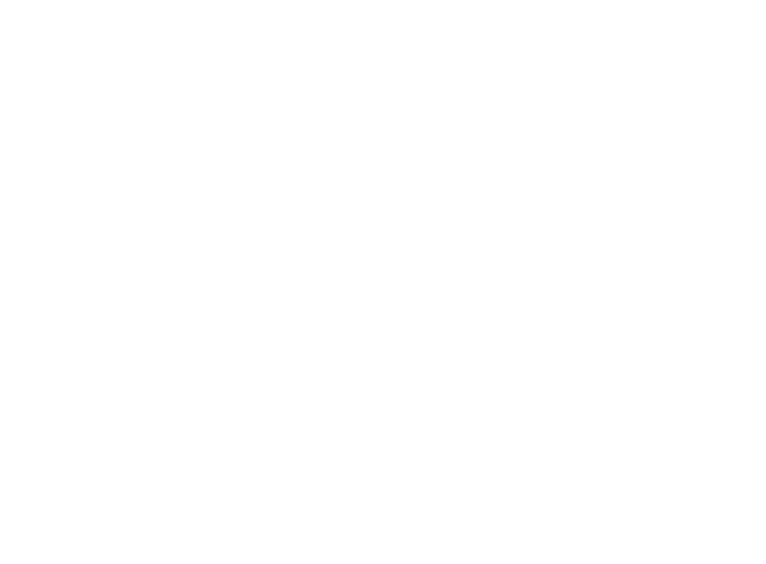

# Implementation

I implemented the following factor graph using gtsam. For measurement factors, I used two different, but equivalent, methods. First, I kept the two types of measurements separate, so there were three custom factor types (2 for measurements and one for dynamics). After performing the speed tests, I was curious to see the impact of the extra calls to python, so I made a combined measurement factor. Although this did improve speed slightly, the difference was not as significant as I expected. Both methods are still available and can be selected by setting:
``` py
use_combined_meas = True # or False.
```

For the propagate and jacobian functions, I copied the exact functions from the previous lab so the performance would be comparable.

For optimizers, the only optimizer that worked was the LevenbergMarquardtOptimizer. The others I tried gave me an error saying the factor graph was ill-posed due to the hook position. My guess is this was caused by not having a prior or measurement for the hook position. 




# Results

## Accuracy

As expected, gtsam and our previous lab had nearly identical intersection over union results.

| Collect  |   GTSAM IOU   |   GN Lab IOU  |
| -------- | ------------- | ------------- |
|    1     |  0.942889719  |  0.942889877  |
|    2     |  0.751524938  |  0.751524499  |
|    3     |  0.917834581  |  0.917834515  |
|    4     |  0.802842387  |  0.802842503  |


# Performance

## Summary

For these tests, only the optimization section of the code was timed, so time spent setting up data structures or doing file IO was not counted. 

I was surprised to see that the original lab (which used sparse matrices) was much faster than gtsam. I was even more surprised to see how much faster the original lab ran in Docker compared to Windows. The original lab in Docker (same container as the gtsam tests) took an average of 6.3 seconds. The gtsam implementation took roughly 10 seconds to complete. I tried a few optimizations, but they had very little impact. One potential cause for the delay that parallel evaluation of custom factors is not supported (according to ProfFan).

To determine how much of the slow-down is caused by the custom factors, I set up the same timing test for the UnicycleExample and ran it with a custom factor and with the built-in BetweenFactor. With the custom factor, the same optimization took almost 4 times longer than with BetweenFactor. With this limitation, you could prototype custom factors in python, but for performance, it would be best to port them over to C once they're working. There may be other factors impacting performance, but that will take further research.

### Based on the results from the UnicycleExample, a version of the pendulum that uses compiled C factors could potentially optimize in roughly 2.5 minute.


## Data

### GTSAM With two measurement factors:
```
Trial 1 completed in 10.299123764038086 seconds
Trial 2 completed in 10.179173469543457 seconds
Trial 3 completed in 10.090628147125244 seconds
Trial 4 completed in 10.201337575912476 seconds
Trial 5 completed in 10.113122940063477 seconds
Average time to optimize: 10.177 seconds
```

### GTSAM With one combined measurement factor:
```
Trial 1 completed in 9.90468430519104 seconds
Trial 2 completed in 9.902482986450195 seconds
Trial 3 completed in 10.03984260559082 seconds
Trial 4 completed in 9.95152497291565 seconds
Trial 5 completed in 9.952269077301025 seconds
Average time to optimize: 9.950 seconds
```

### Original Lab - Sparce Matrices and scipy.sparse.linalg.spsolve(AtA, Aty) - Windows
```
Trial 1 completed in 8.129894971847534 seconds
Trial 2 completed in 8.056883573532104 seconds
Trial 3 completed in 8.111607551574707 seconds
Trial 4 completed in 8.141916751861572 seconds
Trial 5 completed in 8.209982633590698 seconds
Average time to optimize: 8.130 seconds
```

### Original Lab - Sparce Matrices and scipy.sparse.linalg.spsolve(AtA, Aty) - Docker
```
Trial 1 completed in 6.285792350769043 seconds
Trial 2 completed in 6.298067808151245 seconds
Trial 3 completed in 6.341452360153198 seconds
Trial 4 completed in 6.268256187438965 seconds
Trial 5 completed in 6.25591516494751 seconds
Average time to optimize: 6.290 seconds
```

### Unicycle example - CustomFactor
```
Trial 1 completed in 0.47814321517944336 seconds
Trial 2 completed in 0.4806215763092041 seconds
Trial 3 completed in 0.5135376453399658 seconds
Trial 4 completed in 0.4463331699371338 seconds
Trial 5 completed in 0.4529082775115967 seconds
Average time to optimize: 0.474 seconds
```

### Unicycle example - BetweenFactor
```
Trial 1 completed in 0.13832330703735352 seconds
Trial 2 completed in 0.1345365047454834 seconds
Trial 3 completed in 0.14633822441101074 seconds
Trial 4 completed in 0.13354754447937012 seconds
Trial 5 completed in 0.13239455223083496 seconds
Average time to optimize: 0.137 seconds
```

Note: due to the random initialization of the UnicycleExample, there's a good bit of variation between runs. I ran each version multiple times and selected a representative sample for this data.


# Log 

## 4 June

Custom factors for Python have been implemented by ProfFan but have not been merged into the main ```develop``` branch. A pull request was issued about a month ago, but dellaert wisely required more documentation and examples before pulling it into the main branch. The pull request thread went quiet 10 days ago.

Currently, the feature can only be accessed through this branch: ```feature/custom_factor```

I spent 10 hours trying to get optimization working. Originally, I thought I was doing something wrong with my derivatives, so I spent a long time trying various things.

Creating the custom factors is pretty straight forward, but there is a low-level bug that causes all ```optimize()``` calls to hang indefinietly. All preexisting unit tests pass, so the problem must be at a lower level that ProfFan has not tested yet. 

## 5 June

At 7am I figured out a workaround (disabling TBB when compiling gtsam). This was mostly luck as ProfFan mentioned briefly in one of his docs that the custom factors won't work with parallel evaluation. TBB is the first thing I found related to parallelization that I could disable.

At 2am on 5 June, ProfFan pushed a change that fixed the problem I was dealing with, so my workaround is no longer necessary. He also added an actual optimization example. His original code only tested the CustomFactor class by comparing it directly to other Factor types. The bug only came up when running a graph optimizer. My guess is he discovered the bug while implementing the optimization example dellaert requested. His note:
```
ProfFan commented 5 hours ago

Changes:

* Per @dellaert 's request, I added the example trajectory optimization with CustomFactor

* Unit test of optimizing an actual graph

* Fixed linearization of CustomFactor with TBB. Now it will not deadlock trying to acquire the GIL
```

Custom factors are now working, and I have two functional examples besides the one that ProfFan added: 

* LocalizationExample.py - This is a simple example based on ```LocalizationExample.cpp```. According to the table in ```gtsam/examples/README.md```, this example was believed to be impossible in python before now.

* UnicycleExample.py - This is a slightly modified version of the example developed by cntaylor. ProfFan's initial examples were duplicates of the BetweenFactor, so modifying this example was a good first step. I replaced the prior factor and the between factors with custom ones. 


## 7 June

There has been a lot of activity in the merge request thread 767. Some things are changing before they merge into develop, so my examples won't work for long. Most of the changes are minor. The biggest one is changing the order of the parameters to error_func so that measurement comes first. Not a big deal, but it will break my examples. I'm sticking with the version I have for now.

The Pendulum factor graph is now working. The hardest part was correctly linking up dt with the proper indices. I kept the two measurement types separate, so each state has two measurements (a center and a radius). I could have combined these, but I was interested to see how keeping them separate would work. Potentially, I could have another version with a combined measurement factor and see if we get a performance bump from reducing the number of calls back to Python. 

After seeing the relatively poor performance, I combined the measurement factors into a single custom factor, but the speed did not change as much as I expected.


# Notes

## Passing measurements to the custom factor

I'm aware of two methods for passing the measurements to the custom factor. 

* ProfFan's method - LocalizationExample.py - This example uses the functools.partial method for passing measurements to the error function. For each type of custom factor, you just create a new error function with the required arguments.

``` py
def error_func(this: gtsam.CustomFactor, v: gtsam.Values, H: Optional[List[np.ndarray]], mx, my):
	q = v.atPose2(this.keys()[0])
	...

graph.add(gtsam.CustomFactor(UNARY_NOISE, gtsam.KeyVector([1]), partial(error_func, mx=0.0, my=0.0)))

```


* My method - UnicycleExample.py - This example uses a python class to store and access the measurements. I'm not entirely sure how scope works for the error functions, but it appears this method works and may be easier to maintain for more complicated systems.

``` py
@dataclass
class MyCustomPriorFactor:
	
	expected : gtsam.Pose2

	def error_func(self, this: gtsam.CustomFactor, v: gtsam.Values, H: List[np.ndarray]):
		# Get the variable values from `v`
		key0 = this.keys()[0]
		# Calculate non-linear error
		x = v.atPose2(key0)
		error = self.expected.localCoordinates(x)
        ...

mf = MyCustomPriorFactor(x0)
graph.add(gtsam.CustomFactor(prior_noise, [pose_key(0)], mf.error_func))

```


# References

https://github.com/borglab/gtsam/pull/767

https://github.com/borglab/gtsam/issues/748


https://github.com/borglab/gtsam/blob/develop/python/gtsam/examples/README.md

https://github.com/borglab/gtsam/blob/feature/custom_factor/python/CustomFactors.md
https://github.com/cntaylor/gtsam-example

https://github.com/cntaylor/gtsam-python-docker-vscode


